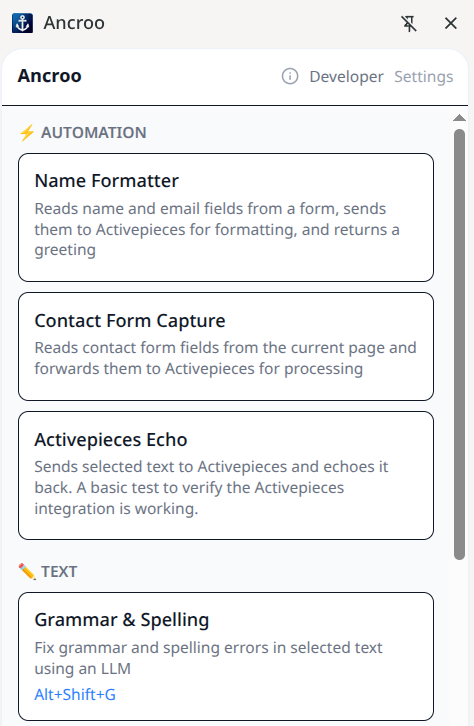
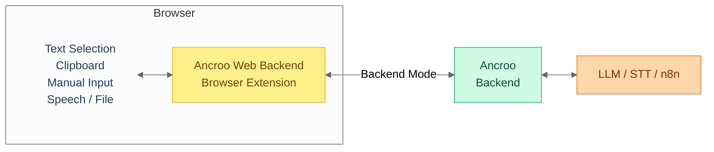

#  Ancroo Web Backend

[](LICENSE)
[](https://www.typescriptlang.org/)
[](https://preactjs.com/)
[](https://vite.dev/)
[](https://tailwindcss.com/)
[](https://pnpm.io/)
[](https://developer.chrome.com/docs/extensions/)


AI Workflow Browser Extension — connects to a self-hosted [Ancroo Stack](https://github.com/ancroo/ancroo-stack) for the full feature set: speech-to-text, n8n automation, tool plugins, file uploads, and multi-user support.

> **Phase 0 (Beta)** — The extension is functional for local use. The backend server runs without encryption or authentication by default and is still under active development — intended for local/trusted networks only. See the [Ancroo Roadmap](https://github.com/ancroo/ancroo/blob/main/ROADMAP.md) for the security path forward.

> **Note:** This extension is not published to the Chrome Web Store. Install manually (see below). For a standalone extension without a backend, use [Ancroo Web](https://github.com/ancroo/ancroo-web) instead.



## Modes

### Backend Mode — Full feature set

Connect to a self-hosted [Ancroo Stack](https://github.com/ancroo/ancroo-stack) for the complete experience: speech-to-text, n8n automation, tool plugins, file uploads, multi-user support, and server-managed workflows.



### Direct Mode — No server needed

Also supports direct LLM calls (OpenAI, Anthropic, Google Gemini, Ollama, OpenRouter) without a backend.

## Features

### Both Modes

- **Side panel UI** — browse and trigger workflows from a side panel (`Alt+Shift+Y` or click the extension icon)
- **Text selection** — select text on any page, right-click "Run with Ancroo", and get AI-processed results
- **Hotkeys** — keyboard shortcuts trigger workflows instantly from any page
- **Clipboard & page context** — workflows can access clipboard content and the current page URL/title
- **Output actions** — results can replace selected text, copy to clipboard, insert before/after, or show in panel
- **Execution history** — last 50 results are stored locally for quick access and re-use

### Backend Mode

- **Push-to-talk audio** — record speech directly in the browser and send it to a Whisper STT workflow
- **File upload** — drag-and-drop or pick files to send to a workflow (with type and size validation)
- **Tool integration** — connect workflows to n8n automations and Ancroo Runner plugins
- **Multi-user** — OAuth2 PKCE authentication with per-user workflow permissions
- **Server-managed workflows** — centralized workflow management via the admin UI

### Direct Mode

- **Multiple LLM providers** — OpenAI, Anthropic, Google Gemini, Ollama (local), OpenRouter, or any OpenAI-compatible endpoint
- **Starter workflows** — six ready-to-use workflows created automatically
- **Local workflow editor** — create and manage workflows with prompt templates, model selection, and input/output configuration
- **Model browser** — auto-detects available models from your provider

## Install

This extension is not published to the Chrome Web Store. Install manually:

1. Download the latest artifact from [GitHub Actions](https://github.com/ancroo/ancroo-web-backend/actions/workflows/build.yml) (click the latest run → **ancroo-web-backend-extension**)
2. Unzip → you get a `dist/` folder

Or build locally:

```bash
pnpm install && pnpm build
# or: ./build.sh   (auto-installs pnpm via corepack if missing)
```

Load in Chrome:

1. Open `chrome://extensions`
2. Enable **Developer mode**
3. Click **Load unpacked** → select the `dist/` folder

## Backend Setup

Install the [Ancroo Stack](https://github.com/ancroo/ancroo-stack) with the Ancroo Backend module. The extension connects to the backend at `http://localhost:8900` by default (configurable).

## Development

```bash
pnpm dev
```

## Project Structure

```
src/
├── background/    # Service worker (hotkeys, mic permission, side panel lifecycle)
├── content/       # Content script (text selection, insertion)
├── shared/        # API client, auth, types, settings, LLM adapters, messages
│   └── llm/       # LLM provider adapters (OpenAI, Anthropic, Gemini, Ollama)
└── sidepanel/     # Side panel UI (Preact)
```

## Contributing

Contributions are welcome! Feel free to open an [issue](https://github.com/ancroo/ancroo-web-backend/issues) or submit a pull request.

## Privacy

See [Privacy Policy](PRIVACY_POLICY.md) — Ancroo collects no data. All settings, API keys, and history stay in your browser. Data is only sent to LLM providers or the backend you configure.

## Security

**API Keys:** API keys are stored in `chrome.storage.local`, which is sandboxed per extension and not accessible by websites or other extensions. Keys are only sent to the configured LLM provider. Note that the storage is not encrypted on disk — anyone with access to your browser profile can read them. This is standard practice for browser extensions.

To report a security vulnerability, please use [GitHub's private vulnerability reporting](https://github.com/ancroo/ancroo-web-backend/security/advisories/new) instead of opening a public issue.

## Acknowledgments

This project is built with the following open-source software:

| Project                                       | Purpose                            | License    |
| --------------------------------------------- | ---------------------------------- | ---------- |
| [Preact](https://preactjs.com/)               | UI framework                       | MIT        |
| [Vite](https://vite.dev/)                     | Build tool                         | MIT        |
| [CRXJS](https://crxjs.dev/vite-plugin/)       | Vite plugin for browser extensions | MIT        |
| [Tailwind CSS](https://tailwindcss.com/)      | CSS framework                      | MIT        |
| [TypeScript](https://www.typescriptlang.org/) | Language                           | Apache-2.0 |

## License

MIT — see [LICENSE](LICENSE). The Ancroo name is not covered by this license and remains the property of the author.

## Author

**Stefan Schmidbauer** — [GitHub](https://github.com/Stefan-Schmidbauer) · [stefan@ancroo.com](mailto:stefan@ancroo.com)

---

Built with the help of AI ([Claude](https://claude.ai) by Anthropic).
